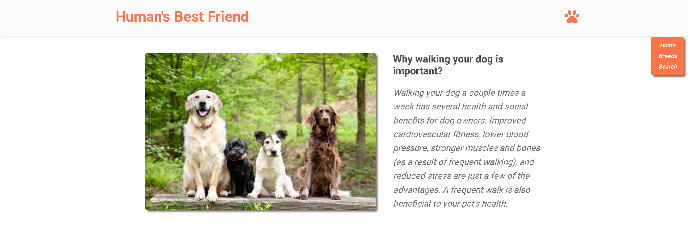
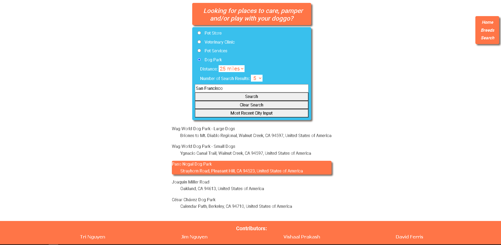

# <Human's-Bestfriend>

## Description

Human's Best Friend was created in response to helping all types of dog lovers, whether one own dog(s) or is looking into owning one. This project was built with the purpose of being a one stop shop for all different type of dog loving need. As a user of the project, they will be able to find local pet store, veterinary clinic, pet services (like grooming) and dog park. By having these locations be assessable in a click of a button, user would be able to care and play with their dog with the knowledge of where everything is at. In addition to search for different location, the user can look at different fun facts about different dog breeds. With the users become more knowledgeable about their dog companion and other dogs in the world.

The project solves dog lover's problem when they are looking for different pet store, veterinary clinic, pet services) and dog park. Additionally, it solves the problem of users who are interested in dogs, but do not know much about different breeds. 

As creating this project, we learned to utilize third-party API through JavaScript fetch and ajax. We learn to efficiently call for the response utilize the data to create a project to serve our purpose of making a site that would cater to dog lovers.

## Installation

Open website through any web browser. This website is built with HTML, CSS, JS, MD Bootstrap, and jQuery.

## Usage

1) To get different dog facts, utilize the drop-down option to select different dog breed. Upon selection, the page will load dog facts of the newly selected dog breed.

2) To search for different location, user would select from provided distance, type of location, search amount and the city. After clicking the search button, results of their search will be printed on the page and their city search will be save to local storage.
Provide instructions and examples for use. Include screenshots as needed. When clicking the search history button, the search input vale will be changed to the previous search.

## Screenshot

## Credits

Parakash, Vishaal - https://github.com/VishaalPrakash

Ferris, David - https://github.com/dferris1135

Nguyen, Tri - https://github.com/tringuyen128

Nguyen, Jim - https://github.com/jimbn

Third-party Assets:

OpenWeather: https://openweathermap.org/

Geoapify: https://www.geoapify.com/

The Dog API: https://thedogapi.com/
